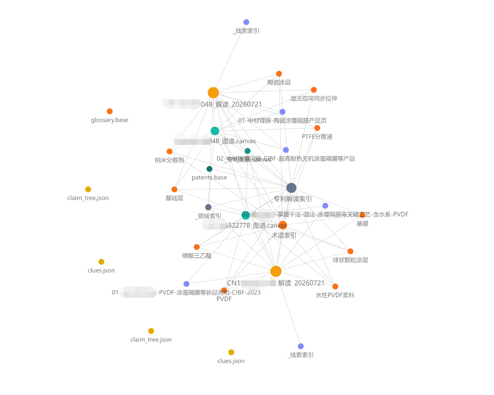
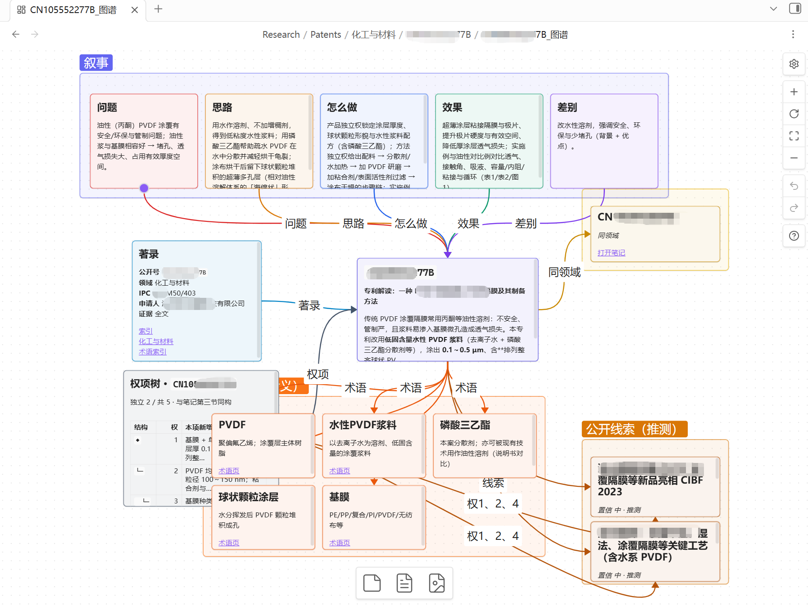

<div align="center">

# 中国专利.skill

> 中国专利 Agent Skill：**挖掘并写成可交付交底书**，或把**已有专利读成通俗笔记**。

[](LICENSE)
[](https://www.python.org/)
[](https://nodejs.org/)
[](https://agentskills.io)

<br>

有设计文档和代码，但**专利点还没梳**？交底书要**框图 + 可改 Word**？<br>
已经有公开专利，但原文太抽象，只想**快速看懂权要与落地语境**？<br>
定稿后还要**多轮补材料、纠错**并留下修改追溯？

**本 Skill 按 AgentSkills 约定编排；`SKILL.md` + `prompts/` 分步可读可迭代。**

[两种用法](#两种用法) · [功能特性](#功能特性) · [安装](#安装) · [使用](#使用) · [示例](#示例) · [运行效果](#运行效果) · [参考文档](#参考文档) · [详细安装说明](INSTALL.md) · [技能入口](SKILL.md)

</div>

---

## 两种用法

| | **专利交底书编写** | **专利通俗解读** |
|--|-------------------|------------------|
| **输入** | 项目文档 / 代码 / 主题 | 公开号、专利 PDF / 全文 |
| **输出** | `{案件}_{时间戳}.md` + `.docx` | Obsidian 解读笔记（或 `outputs/patent_reader/`） |
| **典型说法** | 专利挖掘、交底书、查新、`/交底书` | 读专利、专利解读、`/读专利`、`/patent-read` |
| **入口** | `SKILL.md` 主流程 Step 1–8 | `prompts/patent_plain_reader.md` |

提供专利号或专利全文/PDF 时，技能**优先走解读**，不会默认开交底书流水线。

---

## 功能特性

### 专利交底书编写

<!-- 使用 HTML 表格：避免 GitHub 管道表把左列挤窄 -->
<table>
<colgroup>
<col width="1%">
<col>
</colgroup>
<thead>
<tr><th align="left" nowrap width="1%">能力</th><th align="left">说明</th></tr>
</thead>
<tbody>
<tr><td nowrap width="1%"><strong>项目扫描</strong></td><td>按优先级读文档 / 代码；<code>.docx</code> / <code>.pptx</code> 先转 Markdown 再扫（<code>prompts/project_scan.md</code>）</td></tr>
<tr><td nowrap width="1%"><strong>专利点</strong></td><td>候选点讨论与融合（<code>patent_points_analyzer.md</code>）</td></tr>
<tr><td nowrap width="1%"><strong>查新</strong></td><td><strong>优先</strong> <a href="http://epub.cnipa.gov.cn/">国知局 · 中国专利公布公告</a>（<code>tools/cnipa_epub_search.py</code>）；异常或无果时降级 WebSearch。著录写入第一章（<code>prior_art_search.md</code>）</td></tr>
<tr><td nowrap width="1%"><strong>交底书成稿</strong></td><td>脱敏模版 + <strong>mermaid</strong> 框图与流程图；<code>mermaid_render.py</code> → PNG，默认再出 <strong>.docx</strong></td></tr>
<tr><td nowrap width="1%"><strong>交付命名</strong></td><td><code>{案件名}_{YYYYMMDDHHmmss}.md</code> 与同名 <code>.docx</code>（<code>disclosure_builder.md</code> §7.3）</td></tr>
<tr><td nowrap width="1%"><strong>自检 / 迭代</strong></td><td>逻辑与公式自检（不写入正文）；合并 / 纠正另存新文件 + <code>交底书修订对话记录.md</code></td></tr>
</tbody>
</table>

### 专利通俗解读

**强烈推荐安装 Obsidian**：索引、Canvas 知识图谱、术语网与 callout 配色依赖库内呈现，才能发挥本模式的完整体验。安装与可选社区插件见 [docs/obsidian-setup-guide.md](docs/obsidian-setup-guide.md)。

<table>
<colgroup>
<col width="1%">
<col>
</colgroup>
<thead>
<tr><th align="left" nowrap width="1%">能力</th><th align="left">说明</th></tr>
</thead>
<tbody>
<tr><td nowrap width="1%"><strong>取证解读</strong></td><td>全文 / PDF 抽取 → 权要树、术语表、特征—说明书—附图对照（<code>patent_plain_reader.md</code>）</td></tr>
<tr><td nowrap width="1%"><strong>叙述故事线</strong></td><td>一句话总览 + 连贯叙事：把权要与说明书「讲成人话」，降低首次通读成本</td></tr>
<tr><td nowrap width="1%"><strong>知识图谱</strong></td><td>单篇 <code>*_图谱.canvas</code>、多篇 <code>_专利关联.canvas</code>、术语双链与关系图配色；入库<strong>自动</strong>配置 CSS / Bases</td></tr>
<tr><td nowrap width="1%"><strong>公开线索辅助</strong></td><td>联网检索公开材料（≤3 条）；Agent 读 URL 写摘要；L1–L4 旁注与 <code>clues/</code> 落地，用行业语境辅助理解（<strong>非</strong>权要 / 说明书证据）</td></tr>
</tbody>
</table>

---

## 安装

### 接入任意支持 Agent Skills 的环境

通用做法（任选其一）：

1. **克隆 / 复制到宿主的 skills 目录**（全局或当前项目均可），例如：
   ```bash
   git clone <本仓库 URL> <宿主-skills目录>/patent-disclosure-skill
   ```
2. **直接用 Agent 打开本仓库根目录**作为工作区；此时把「含 `SKILL.md` 的目录」当作技能根。
3. 在对话里用自然语言或斜杠触发（如「写交底书」「读专利」）；以当前宿主是否扫描到本技能为准。

Claude Code、Cursor、以及其他兼容 AgentSkills 的客户端，具体落盘路径不同，详见 [INSTALL.md](INSTALL.md)。装好后按宿主习惯重启 / 刷新，确认技能已被发现即可。

### 依赖

```bash
# 共用基础（Office 转换、交底书相关 Python 包）
pip install -r requirements.txt
```

```bash
# 可选：国知局查新（交底书 Step 5）
pip install -r tools/requirements-cnipa.txt
python -m playwright install chromium
```

```bash
# 可选：专利解读 PDF 抽取
pip install -r tools/patent_reader/requirements.txt
```

- **交底书图示定稿**另需 **Node.js**：在 `tools/` 下 `npm install` 或使用 `npx mmdc`（见 [tools/README.md](tools/README.md)）。  
- **解读 + Obsidian**：**强烈推荐**配置 Obsidian 库（`PATENT_READER_OBSIDIAN_VAULT`），才能完整体验索引、Canvas、术语网、关系图配色与公开线索旁注；无库时可降级到 `outputs/patent_reader/`，效果会弱一截。Windows 安装与可选社区插件见 [docs/obsidian-setup-guide.md](docs/obsidian-setup-guide.md)。  
- 不装国知局依赖时，查新按 `prior_art_search.md` 降级为 **WebSearch**。

---

## 使用

### 专利交底书编写

在 Agent 中用自然语言即可，例如：专利挖掘、专利点、**技术交底书**、查新、现有技术对比；斜杠如 `/patent-disclosure-skill`、`/交底书`。

建议说明 **项目路径** 或 **技术主题**。查新优先 [中国专利公布公告](http://epub.cnipa.gov.cn/)，见 `prompts/prior_art_search.md`。  
在**已有交底书**上补材料或纠错时无需说「迭代」——按 `merger.md` / `correction_handler.md` 另存新稿；细则见 [SKILL.md](SKILL.md)。

### 专利通俗解读

例如：读专利、专利解读、看懂权要、`/读专利`、`/patent-read`，并给出**公开号或 PDF 路径**。

技能会走阅读模式：取证 → 叙述故事线 → 公开线索辅助 →（推荐）Obsidian 入库与知识图谱。**强烈推荐**配置库路径以获得完整体验；无库时仍可落到 `outputs/patent_reader/`。流程与工具见 [tools/patent_reader/README.md](tools/patent_reader/README.md)、[SKILL.md](SKILL.md)「专利通俗解读」。

---

## 示例

- **交底书**：虚构扫描原材料见 [examples/README.md](examples/README.md)（如 `examples/example_batch_job_scheduler/knowledge/`）。  
- **专利解读**：示例 PDF 镜像见 [examples/example_patent_reader/README.md](examples/example_patent_reader/README.md)（材料本地自备，不入库）。  

完整产物由流程生成到 **`outputs/`** 或 Obsidian 库。

---

## 运行效果

### 专利交底书编写

<table width="100%" border="1" cellpadding="12" cellspacing="0">
<tr>
<th width="50%" align="center">初版生成<br><sub>首次落盘交付</sub></th>
<th width="50%" align="center">迭代更新<br><sub>多版本并存 + 对话记录</sub></th>
</tr>
<tr>
<td width="50%" valign="top" align="center">

</td>
<td width="50%" valign="top" align="center">

</td>
</tr>
</table>

### 专利通俗解读

<table width="100%" border="1" cellpadding="12" cellspacing="0">
<tr>
<th width="50%" align="center">Obsidian 关系图<br><sub>知识图谱与多色节点</sub></th>
<th width="50%" align="center">解读 Canvas<br><sub>叙事故事线 · 术语 · 公开线索</sub></th>
</tr>
<tr>
<td width="50%" valign="top" align="center">

</td>
<td width="50%" valign="top" align="center">

</td>
</tr>
</table>

---

## 参考文档

- [技能入口与 Agent 流程](SKILL.md)（交底书主流程 + 阅读模式）
- [详细安装说明](INSTALL.md)
- [交底书：图示与转换 / 国知局工具](tools/README.md)
- [专利解读工具](tools/patent_reader/README.md)
- [Obsidian 安装与可选社区插件（Windows）](docs/obsidian-setup-guide.md)
- [示例案件与原材料](examples/README.md)
- [产品流程与目录约定](docs/PRD.md)
- [工程结构说明](docs/skill-structure.md)
- [交底书模版细则](prompts/template_reference.md)

---

## 支持作者

如果这个 Skill 帮您节省了写交底书或读专利的时间，可以请我喝杯咖啡☕随缘支持，感谢感谢🙏🙏

<div align="left">

<table>
<tr>
<td valign="middle" align="left" style="padding-right: 16px;">


</td>
<td valign="middle" align="left">

<a href="https://www.star-history.com/?repos=handsomestWei%2Fpatent-disclosure-skill&type=date&legend=top-left">
  <picture>
    <source media="(prefers-color-scheme: dark)" srcset="https://api.star-history.com/chart?repos=handsomestWei/patent-disclosure-skill&type=date&theme=dark&legend=top-left&sealed_token=3x7lB-ukmgYV6dQnnyC7mizaGl21b5P2rvt3hOF5jivrmOMC8ECvlFUwK43lQL4R5pv5RdhPx1otMUMRtT-yqdSdupltyMQXv2AwlATvoAt9vDDNDTgJ8R0mO3PZUOB6KUtFvi2N64K9vpWW5tHLUcTtN-bC56RsQ8n3CsujxIj-VcQszIwG20EET5pz" />
    <source media="(prefers-color-scheme: light)" srcset="https://api.star-history.com/chart?repos=handsomestWei/patent-disclosure-skill&type=date&legend=top-left&sealed_token=3x7lB-ukmgYV6dQnnyC7mizaGl21b5P2rvt3hOF5jivrmOMC8ECvlFUwK43lQL4R5pv5RdhPx1otMUMRtT-yqdSdupltyMQXv2AwlATvoAt9vDDNDTgJ8R0mO3PZUOB6KUtFvi2N64K9vpWW5tHLUcTtN-bC56RsQ8n3CsujxIj-VcQszIwG20EET5pz" />
    
  </picture>
</a>

</td>
</tr>
</table>

</div>

---

<div align="center">

MIT License © [handsomestWei](https://github.com/handsomestWei/)

</div>
